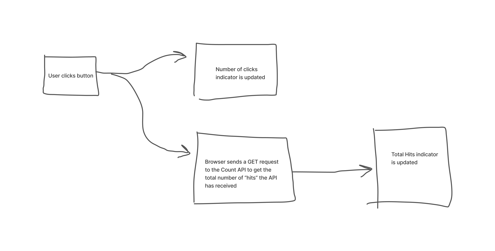

# Purple Cow Project
### This web app now only allows the user to click on a button that displays the number of total hits the Counter API (https://countapi.xyz/) has received, but it also keeps track of the number of times the user has clicked on the button. The app was built using Vue.js, HTML, CSS, SASS, JavaScript, and BEM.

## Here is a simple flow chart to demonstrate how it works


## Project setup and configuration
### Before attempting to run the application, please take a second to install its dependencies. This can be accomplished by running the following command:
```
npm install
```
### After installing the dependencies you will be able to fire up the application. Use the command below. Please not the default port the application will run on is `:8080`:  
```
npm run serve
```
### If you wish to change the port number the application runs on, then run this command:
```
npm run serve -- --port 3000
```
### To compile and minify the application for production run the following command:
```
npm run build
```
### To lint and fix files (indents, spacing, etc) run this command:
```
npm run lint
```

<!-- ## Customize configuration
See [Configuration Reference](https://cli.vuejs.org/config/). -->
